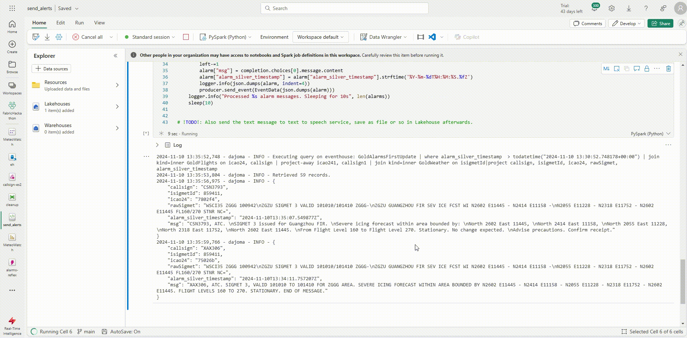

# 🌐 MeteoWatch: Real-time Aviation Weather Intelligence

##  Overview
MeteoWatch is a real-time intelligence solution designed to monitor flights for potential weather hazards. Developed during the [Microsoft Fabric and AI Learning Hackathon](https://microsoftfabric.devpost.com/), MeteoWatch leverages Microsoft Fabric and Azure OpenAI to enhance aviation safety awareness.

##  What it does
MeteoWatch integrates data from OpenSkyNet, ADS-B, and AviationWeather to provide:

- 🛩️ Real-time tracking of aircraft positions and flight routes
- 🌪️ Monitoring of areas with reported SIGMETs (Significant Meteorological Information)
- ⚠️ Calculation of potential SIGMET impacts on flights
- 💬 Generation of warning messages for affected aircraft
- 📊 A dashboard for stakeholders such as air traffic controllers and pilots

##  How we built it
MeteoWatch utilizes a combination of technologies:

1. 📥 **Data Ingestion**: Notebooks extract data from web APIs into an EventStream, which feeds an EventHouse.
2. 🏗️ **Architecture**: Implements a real-time intelligence medallion architecture.
3. 🔄 **Data Transformation**: Update policies process data from bronze to silver layers.
4. 🧮 **Data Processing**: Materialized views on the silver layer handle geometries, intersections, alarms, and data aggregation.
5. 🤖 **AI Integration**: Azure OpenAI API is used to generate warning messages.
6. 🚨 **Alert System**: EventStream sends alerts to Reflex for notification distribution.
7. 📈 **Visualization**: A dashboard in Power BI built on the gold layer displays relevant information.

##  Installation Guide for Microsoft Fabric

To set up MeteoWatch:

1. 🏗️ Create a new Microsoft Fabric workspace
2. 🔀 Fork or import this repository into Azure DevOps
3. 🔗 Link the `fabric` folder to your workspace
4. 🏠 Set up an EventHouse and KQL database
5. 📜 Create KQL database artifacts using provided querysets: `weather`, `aircrafts`, `callsigns`, `openskynet`, `flights`, `alarms`, `shapes`
6. 🌊 Create 5 EventStreams with custom endpoint sources: `openskynet-es`, `weather-es`, `callsigns-es`, `aircrafts-es`, `alarms-es`
7. 🔄 Update and run ingestion notebooks
8. 🔌 Configure ingestion EventStream sinks to corresponding bronze tables (direct ingestion)
9. 🔑 Update and run the `send_alerts` notebook
10. ⚡ Create a Reflex (alarms-es) based on the alarms EventStream
11. 🔍 Open report/semantic model and resolve any connection/reference issues

After completing these steps, your MeteoWatch system should be operational. 🎉
