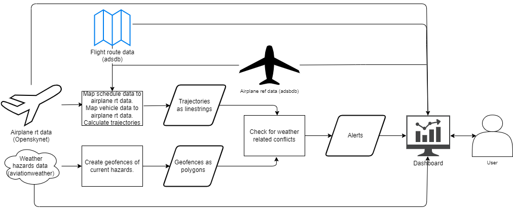
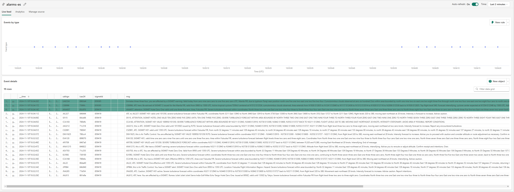
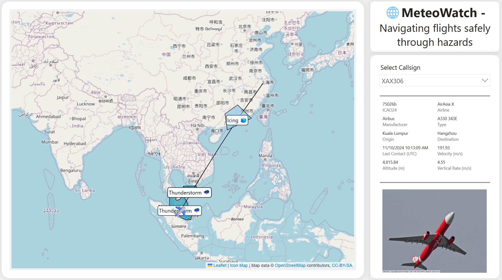

# Overview
MeteoWatch is a realtime intelligence solution based on open aviation data that monitors flights in regards to weather hazards. MeteoWatch was built during the [Microsoft Fabric and AI Learning Hackathon](https://microsoftfabric.devpost.com/) and is based on microsoft fabric and azure openai.
- [What it does](#what-it-does)
- [How we built it](#how-we-built-it)
- [How to install MeteoWatch on Microsoft Fabric](#how-to-install-meteowatch-on-microsoft-fabric)
# What it does
The system consumes data from openskynet, adsdb and aviationweather. Using this data MeteoWatch knows the current position of aircrafts and their flight route. Further the systems knows the area where weather hazards so called SIGMETs (Significant Meteorological Information) are reported. MeteoWatch then calculates whether a flight will be affected by a Sigmet and creates a warning message in natural language. This message could be tailored and send to a specific aircraft. Further MeteoWatch contains a dashboard where related stakeholders like air control or pilots are presented the flight route and affecting weather hazards as well as other useful information. 

# How we built it
The ingestion is built with notebooks. All the data is available via web apis. We send the data to eventstream to ingest it into an eventhouse. Simply put we build a real time intelligence medaillon architecture. We use update policies to do basic transformations and cleanup from bronze to silver layer. On top of the silver layer we use materialized views to create geometries in different formats, calculate intersections, track alarms, aggregate to newest information, etc.. We then use a notebook to send the alarms to azure openai api to create more meaningful warning messages. These are send to eventstream and from their to reflex, where alerting via email, teams message, etc. could be configured. Further we build a dashboard on top of the gold layer where all the geometries (positions, trajectories, hazards) as well as other useful information are displayed.

# How to install MeteoWatch on Microsoft Fabric
Sadly at point of developing this project not all microsoft fabric artefacts are versioned by git. Following steps should be taken to get this running:
1. Create a new microsoft fabric workspace
2. Create a copy of this repository, e.g. forking or importing into Azure DevOps
3. Link the fabric folder within this repository to the workspace
4. Create an eventhouse and kql database
5. Create all the kql database artefacts using the corresponding kql querysets: weather, aircrafts, callsigns, openskynet, flights, alarms, shapes
6. Create 5 eventstreams (openskynet-es, weather-es, callsigns-es, aircrafts-es, alarms-es) with custom endpoint as source
7. Update references like endpoints, secrets, etc. in ingestion notebooks and start running them
8. Set the sink in each of the ingestion eventstreams to the corresponding bronze table using direct ingestion and use in queryset defined ingestion-mappings if applicable 
9. Update references like endpoints, api keys in send_alerts notebook and start running it
10. Create a reflex (alarms-es) based on alarms eventstream
11. Open report/semantic model and fix connection/reference issues

You should be good to go now!
